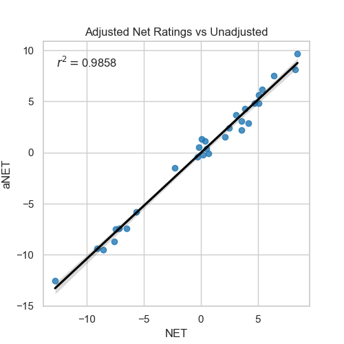
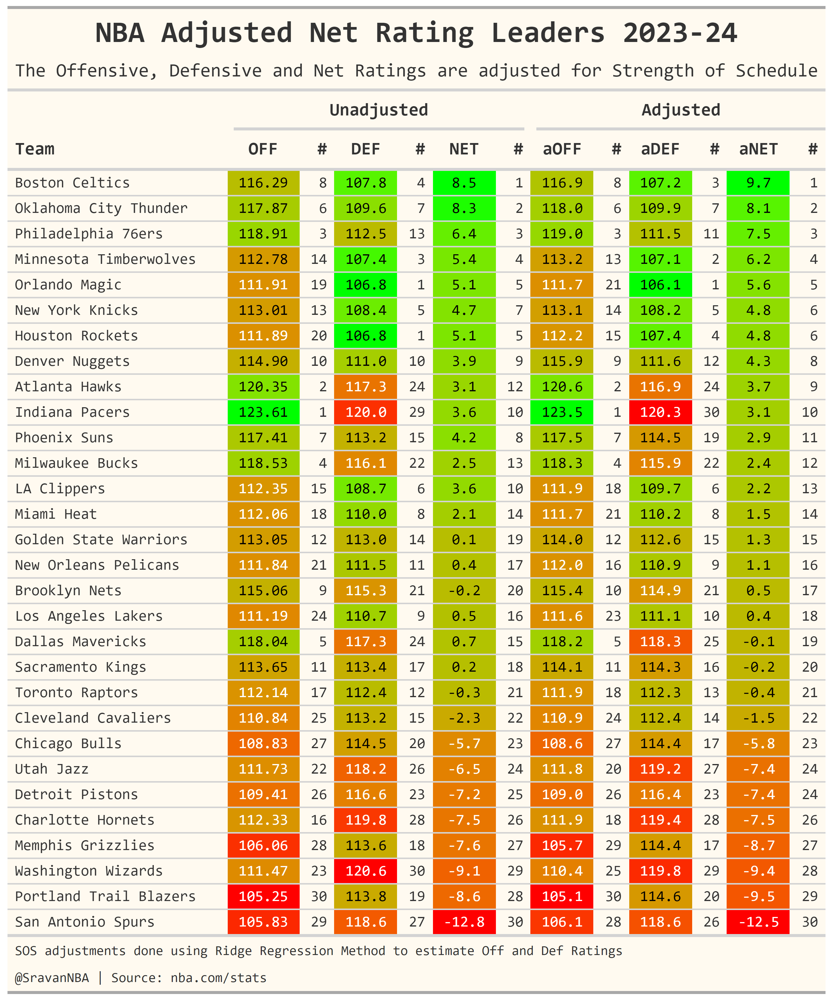

+++
title = "Adjusting NBA Teams' Offensive and Defensive Ratings I: using Strength of Schedule"
date = "2023-11-26"
description = "Using Ridge Regression to implement SRS method for adjusting offensive and defensive ratings for strength of schedule"

[taxonomies]
tags = ["strength-of-schedule","team-ratings"]
categories = ["NBA"]
[extra]
math = true
math_auto_render = true
toc = true
keywords = "Net Rating, Strength of Schedule, SoS, SRS, RAPM, Adjusted Ratings"
+++

This blog post goes through my process of adjusting NBA Teams' Offensive and Defensive Ratings for strength of schedule (SoS). This is the my first NBA post on this blog. Hopefully there will be more in the future. I'll try to update my earlier blog posts on my Medium blog [basketballobservations](https://medium.com/basketballobservations) here too. Those posts were when I was new to NBA analytics and python coding, and even blogging. I've improved a lot since and even written a few more blog posts, so hopefully the updated posts will be a lot better.

## Introduction

In NBA we measure a team's performance by using efficiency stats such as Offensive, Defensive and Net Ratings. Earlier in a NBA season, the teams play wildly different schedules. Some teams play a lot of weak teams and some teams play a lot of hard teams. Let's say a team playing weak teams is winning by a lot. Now, how do we differentiate that team from a team playing strong teams but is winning only by a little? Also, there are teams who are facing bad luck. By bad luck I mean outlier opponent shooting etc. So adjusting the team's ratings by strength of schedule and/or luck will give us a better indicator of a team's performance than raw (unadjusted) ratings.

## Motivation
This work was inspired by a tweet by [Kevin](https://twitter.com/NBACouchside). He [produced Opponent Adjusted 4-Factor ratings](https://twitter.com/NBACouchside/status/1720610641281429771) which adjust for HCA using regression of 4 Factor components with Bayesian Padding. On the same day [Krishna Narsu](https://twitter.com/knarsu3) (creator of all-in-one metric `LEBRON`), also released his [luck adjusted ratings](https://twitter.com/knarsu3/status/1611511553588600832) which uses both 4 factors and shot quality data. The method used by him for adjustment was [Nathan Walkers's](https://twitter.com/bbstats) LeHigh method. I tried looking into how these were done but quickly realized that I was out of my depth and have to start with something more simple. And the approach I went with is literally called simple rating system (SRS). Approximately 10 days after Krishna's and Kevin's tweets, I found another [adjusted ratings tweet](https://twitter.com/JerryEngelmann/status/1723566732038799456) using a SRS approach, this time by [Jerry](https://twitter.com/JerryEngelmann) who is the creator of ESPN's Real Plus Minus. I replied to asking how the adjustments were done, and he helped me with getting my algorithm for estimating the adjusted ratings set up.  You can find our conversation [here](https://x.com/SravanNBA/status/1724250684181348458?s=20).

## SRS Method
So, what exactly is the SRS approach? The original page on basketball-reference's website is unavailable but you can find the archived version [here](https://web.archive.org/web/20161031224357/http://www.pro-football-reference.com/blog/index4837.html). Please read that article if you want to know the details and math, because I won't do through them here. 

## Modified SRS Method
The approach used in the article, works on adjusting the net ratings for SoS but not for offensive and defensive ratings. So, Jerry suggested this approach:
> 2 rows per game, double the variables (team-off, team-def). Instead of point differential use offensive efficiency of the offensive team, in that game

Translating that to an equation form we have:
$$\hat{Team}^1_{OFF} + \hat{Team}^2_{DEF} = Team^1_{OFF} $$
$$\hat{Team}^2_{OFF} + \hat{Team}^1_{DEF} = Team^2_{OFF} $$

which means that the team's offensive rating depends on their own estimated offensive rating and the opponents estimated offensive rating. 
But for unadjusted ratings we have, 
$$Team^1_{OFF} = Team^2_{DEF} $$
$$Team^2_{OFF} = Team^1_{DEF} $$

which means that Team1's offensive rating is equal to Team2's defensive rating for that game. So, using that logic we can modify our estimation equation as:
$$\frac{1}{2}\hat{Team}^1_{OFF} + \frac{1}{2}\hat{Team}^2_{DEF} = Team^1_{OFF} $$
$$\frac{1}{2}\hat{Team}^2_{OFF} + \frac{1}{2}\hat{Team}^1_{DEF} = Team^2_{OFF} $$
which takes care of normalization.

So, we have two of these equations per game. Now we use an RAPM style approach to set up the regression problem. 

## Estimating Ratings using RAPM style approach
You can find details on RAPM and how the math problem for RAPM is formulated [here](https://squared2020.com/2017/09/18/deep-dive-on-regularized-adjusted-plus-minus-i-introductory-example/). We use the same approach here, with each stint being the game played with estimated variables here being team ratings instead of player RAPM.

The regression problem is solved using Ridge-Regression method. From `scikit-learn`'s [website](https://scikit-learn.org/stable/modules/linear_model.html#ridge-regression-and-classification):
> Ridge regression addresses some of the problems of Ordinary Least Squares by imposing a penalty on the size of the coefficients. The ridge coefficients minimize a penalized residual sum of squares:

$$\min_{w} || X w - y||_2^2 + \alpha ||w||_2^2$$
where $X$ is the LHS of our equation and $y$ is the RHS.
We don't know the value of regularization parameter $\alpha$ here. We can estimate $\alpha$ automatically using `scikit-learn`'s [Ridge-CV method](https://scikit-learn.org/stable/modules/generated/sklearn.linear_model.RidgeCV.html#sklearn.linear_model.RidgeCV) which performs Leave-One-Out Cross-Validation. Ridge-CV outputs $\alpha$, the values of adjusted team offensive and defensive ratings, and finally the intercept.
Here is the equation for the fit:
$$\hat{y}(w, x) = w_0 + w_1 x_1 +  w_2 x_2$$
where $w_1$ is Team1 offensive rating, $w_2$ is Team2 defensive rating, $\hat{y}(w, x)$ is the actual Team1 offensive rating, and $w_0$ is the intercept.  The intercept can be interpreted as the average value of offensive and defensive ratings of all teams. 
We have to add the intercept value to the team ratings the algorithm spits out to get the actual values of adjusted team ratings like so:

$$\hat{Team}^1_{aOFF} = w_0 + w_1 x_1$$
$$\hat{Team}^2_{aDEF} = w_0 + w_2 x_2$$

Finally we can calculate Net Rating as so:

$$ Team_{aNET} = Team_{aOFF} - Team_{aDEF}$$

## Analyzing Results
The plot below shows the fit of adjusted vs unadjusted net ratings.

We can see that the adjusted net ratings and unadjusted net rating are very close to each other with an $r^2 = 0.986$. But this doesn't mean that it doesn't affect the final ranking of net ratings or off/def ratings. The changes in rankings in net ratings are observed mostly in the middle of the table as can be seen in the below table:

Here is another table which shows how much the ratings are affected my strength of schedule. The movement (M) column in the table indicates how much the rating has moved is calculated as 

$$ Movement = Adjusted Rating Rank - Unadjusted Rating Rank $$

We can see that Pelicans and Rockets have lost the most on offense, while Clippers and Heat have gained the most. Similarly on defense, Bulls have lost the most, while Suns have gained the most ranks. Finally in Net rating, Mavs have gained the most while the Warriors have lost the most ranks.

## Visualizing the Net Ratings: Efficiency Landscape

[Kirk Goldsberry](https://twitter.com/kirkgoldsberry) has popularized the [efficiency landscape graph](https://x.com/kirkgoldsberry/status/1728091510086742216?s=20), which is nothing but a simple plot showing offensive rating on the x axis and defensive rating on the y axis. Here is the efficiency landscape using my adjusted ratings:

## Conclusions
Hope this blog shows what adjusted ratings are and how to do them. The code used to generate figures from this blog can be found at:
[https://github.com/sravanpannala/NBA/blob/master/Leaderboards/nba_SOS_adj.ipynb](https://github.com/sravanpannala/NBA/blob/master/Leaderboards/nba_SOS_adj.ipynb).  
You can also find adjusted team ratings regularly updated from [basketball reference](https://www.basketball-reference.com/leagues/NBA_2024_ratings.html#ratings) and [Dunks&Threes](https://dunksandthrees.com/).  
If I figure out how to do Home court adjustment (HCA) or luck adjustment, I'll try to publish a sequel to this post.