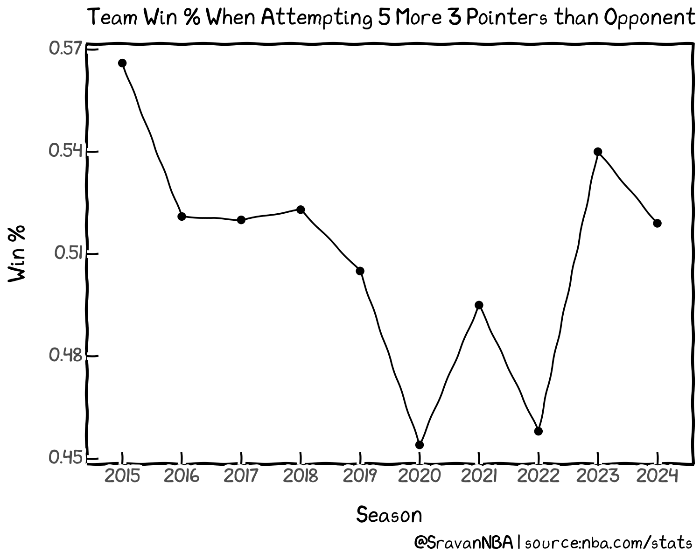
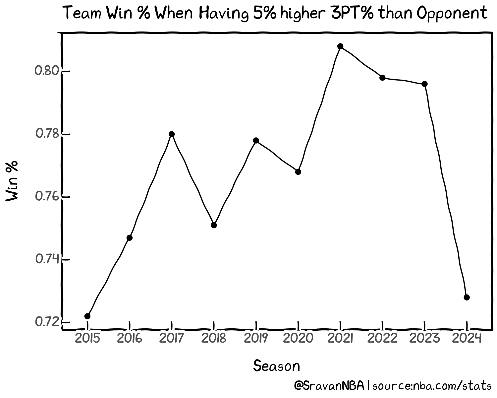

+++
title = "Importance of the 3 Point Shot: How does 3 Point Shooting Relate to Winning in the NBA"
date = "2023-12-13"
description = "Analyzing three point trends in the NBA and see how they relate to wins"

[taxonomies]
tags = ["shooting","3PT","win-loss"]
categories = ["NBA"]
[extra]
toc = true
keywords = "Shooting, Three Point Shot, 3PT, win-loss"
+++

## Introduction
Three-point shooting is everywhere in the NBA currently. Teams are attempting and making more threes. Here are 3 Point attempts (3PA) per game (PG) every season for the last 10 seasons (including this one):

<!--  -->

3PA per game was around 22 in 2014-15 and increased yearly till the 2021-22 season. The 3PA per game since has stabilized to a value between 34-35 per game. Meanwhile, the accuracy of 3PT shots hasn't changed drastically over the years, fluctuating between 35 and 37%:

<!--  -->

So, we see that even though 3PA increased over the past decade, the accuracy still hasn't changed drastically. So what about the number of 3PT makes per game:

<!--  -->

We see that 3PM has increased from around 8 makes in 2014-15 to around 12 makes in 2020. Also, because 3PA has stabilized over the past seasons and the accuracy isn't much different from season to season, we see that the number of 3PT makes per game has stabilized to a value of around 12.5 over the past 5 seasons.

But are all the increased 3PT shooting resulting in more wins for teams? What I'm interested in exploring is how important 3PT shooting is to winning games, which is the end goal.

## How often does a team win when it attempts more 3s than the opponent:
First, let's see if just attempting more 3s (3PA) than the opponent is enough to win. Here is how often the teams win in such a condition:

<!--  -->

We see that teams initially had an advantage when attempting more 3s than opponents from 2014-2019. But that advantage has decreased from a 55% winning rate in 2014-15 to around 50% in 2018-19. From 2018-19 to the current season, there is no correlation between 3PA and winning.
> So, this means that the simple math advantage the teams had initially (3 > 2) doesn't exist anymore. 
 
We see similar trends even when teams attempt 5 more 3-pointers than their opponents:

<!--  -->

Hence, we have to explore additional metrics like 3PM and 3PT%.

## How often does a team win when it outscores its opponent from 3PT range:
### Team 3PM > Opponent 3PM
The second aspect I want to explore is the raw output (3PM), i.e. what if a team makes more 3's than its opponent? Here is how often the teams win in those situations:

<!--  -->

We see that teams win anywhere between 64-68% when they make more 3s than their opponents. This translates to 52.5 to 56 wins in an 82-game season. The win percentage has stabilized at around 66.9% over the past 3 seasons, equivalent to around 55 wins.

So, we can conclude that making more 3-pointers than opponents plays a huge role in winning, and teams win around 2/3rd of their games in such situations.

### Team 3PM > Opponent 3PM + 2
What if a team makes 2 more 3 pointers than their opponents:

<!--  -->

In such situations, we see that the teams win anywhere between 70% and 74% of their games, which translates to 57.5 to 61 wins. If we consider an average win % of 72 we get to 59 wins, which is 4 wins higher than when teams just make more 3s than opponents. 

## How often does a team win when it is more accurate than its opponent from 3PT range:
### Team 3PT% > Opponent 3PT%
Next, I want to explore how important the accuracy i.e., the 3PT percentage (3PT%), rather than makes, is to team winning. Here is how often teams win in those situations:

<!--  -->

We see that teams win anywhere between 68-74% when they make more 3s than their opponents. This translates to 55 to 60.5 wins in an 82-game season. The win percentage is around 70.5% over the past 2 seasons, equivalent to around 58 wins.

Thus, we see that teams win at a slightly higher rate when they're more accurate from 3, compared to just making more 3s.

### Team 3PT% > Opponent 3PT% + 5%
Now, what if team 3PT% is 5% higher than opponent 3PT%:

<!--  -->

In this situation, teams win anywhere between 72% and 81%, which is a much higher percentage than the previous situations explored. This is equivalent to 59-66.5 wins during an 82-game season. We observe an increasing trend in win% in this condition from 2014-2021, peaking at 80.8% during the 2020-21 season. Then, there was a slight drop off to 79.8% during 2021-22 and 79.6% during 2022-23, before going through a sharp drop off to 72.8% for this season. Since only a quarter of this season's games have been played as of today, there is a chance that this number might rise by the end of the season. I think we have to revisit and observe the trend at the end of the season.

So, removing this season, the teams are winning at around 80%, equivalent to 65.5 wins when the teams' 3PT% is 5% higher than the opponent's 3PT%. This condition shows a much higher correlation to winning than the previous conditions, which were closer to 55-58 wins.

## Conclusion

Analyzing the 3PT trends over the past 10 seasons shows that 3PT accuracy correlates greatly to winning. Teams win 80% of their games when team 3PT% is 5% higher than opponent 3PT%, equivalent to 65.5 wins during an 82-game season. This number shows the importance of accurate 3PT shooting to winning in the NBA.

Thank you for reading, and any feedback is appreciated. You can reach me on Twitter at [@SravanNBA](https://twitter.com/SravanNBA).