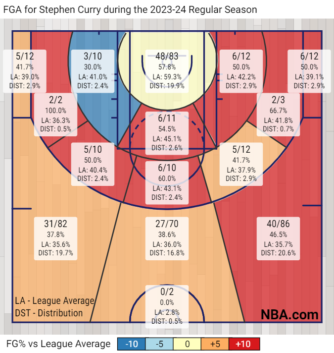

+++
title = "Simple Shot Quality Model (SSQM) 0.0"
date = "2023-12-16"
description = "My attempts on creating a shot quality model using publicly available NBA data"

draft = true

[taxonomies]
tags = ["NBA","Players","Teams","Shot Quality","SSQM"]
+++

## Introduction
- was digging into adjusted net ratings
- knarsu3 uses `qSQ` and `qSI` in his luck adjusted team ratings 
- have been interested in shot quality ever since
- Second Spectrum and not public
- So wanted to see if I can develop a model on my own

## Getting Started
- Before starting from scratch I look at existing work from other people 
- Ryan Davis and Andrew Patton have good tutorials for NBA Analytics with working code.
- [Andrew Patton's Shot Quality Model Tutorial](https://github.com/anpatton/basic-nba-tutorials/tree/main/shot-quality)
- Andrew shows the approach of how to model shot quality and the data processing framework necessary for creating a shot quality metric
- After trying my own variations of Andrew's demo shot quality models, I wanted to try something different while utilizing some of the concepts he introduced in the tutorial.

## Using League Average Shooting
- I have been making NBA Hex Plots for more than 2 years now.
- add image
- The different colors in hex plots shows how efficient a player is wrt league average.
- How is does it is bins the shots into different zones and calculates the `FG%` of all shots in the zone attempted by the player. It then compares it to the league average `FG%` of all shots in the zone attempted by all players in that season.
- Here are the shot zones and the league averages shown in Steph Curry's shot-chart for the season:

<!--  -->

-  This is actually the framework for a simple shot quality model and thus name `SSQM` (sounds like a good name for a model which is very simple/basic).

## Developing the Shot Quality Model Metrics
-  I will be using the league average `FG%` as expected `FG%` in my model and will refer it as `xFG` from now now.
-  So the expected points scored are:


xPTS=\begin{cases}
    2\times FGA \times xFG  &, FGA \text{ is 2 pointer} \\ 
    3\times FGA \times xFG  &, FGA \text{ is 3 pointer} \\ 
\end{cases}
 

- Effective field goal percentage (`eFG`) is calculated as:
  
$$ eFG = \frac{PTS}{2\times FGA} $$

- Similarly expected `eFG` (`xeFG`) is calculated by replacing `PTS` with `xPTS`.
  
$$ xeFG = \frac{xPTS}{2\times FGA} $$

- `Shot Making` is defined as:

$$ \text{Shot Making} = \frac{PTS - xPTS}{FGA} $$

- `Points Added` is defined as:

$$ \text{Points Added} = PTS - xPTS $$

- Another way of calculating `Points Added`:

$$ \text{Points Added} = \text{Shot Making}\times FGA $$

## Best Shot Makers 

|    | Player            | Team                  |   FGA |   FGM |   eFG |   xeFG |   PTS |   xPTS |   Shot Making |   Points Added |
|---:|:------------------|:----------------------|------:|------:|------:|-------:|------:|-------:|--------------:|---------------:|
|  1 | Jalen Smith       | Indiana Pacers        |    75 |    53 | 0.8   |  0.586 |   120 |   87.8 |          0.43 |          32.25 |
|  2 | Cason Wallace     | Oklahoma City Thunder |   110 |    65 | 0.705 |  0.56  |   155 |  123.2 |          0.29 |          31.9  |
|  3 | Jakob Poeltl      | Toronto Raptors       |   164 |   118 | 0.72  |  0.598 |   236 |  196.2 |          0.24 |          39.36 |
|  4 | Dereck Lively II  | Dallas Mavericks      |   118 |    87 | 0.737 |  0.615 |   174 |  145.1 |          0.24 |          28.32 |
|  5 | Matt Ryan         | New Orleans Pelicans  |    83 |    38 | 0.651 |  0.534 |   108 |   88.6 |          0.23 |          19.09 |
|  6 | Malik Beasley     | Milwaukee Bucks       |   215 |   104 | 0.649 |  0.54  |   279 |  232.1 |          0.22 |          47.3  |
|  7 | Daniel Gafford    | Washington Wizards    |   122 |    85 | 0.697 |  0.593 |   170 |  144.6 |          0.21 |          25.62 |
|  8 | Sam Hauser        | Boston Celtics        |   153 |    71 | 0.66  |  0.556 |   202 |  170.1 |          0.21 |          32.13 |
|  9 | Tyrese Haliburton | Indiana Pacers        |   350 |   182 | 0.627 |  0.529 |   439 |  370.4 |          0.2  |          70    |
| 10 | Alex Caruso       | Chicago Bulls         |   125 |    67 | 0.664 |  0.57  |   166 |  142.6 |          0.19 |          23.75 |

## Worst Shot Makers

|    | Player          | Team                   |   FGA |   FGM |   eFG |   xeFG |   PTS |   xPTS |   Shot Making |   Points Added |
|---:|:----------------|:-----------------------|------:|------:|------:|-------:|------:|-------:|--------------:|---------------:|
|  1 | Toumani Camara  | Portland Trail Blazers |   145 |    55 | 0.438 |  0.569 |   127 |  165.1 |         -0.26 |         -37.7  |
|  2 | Scoot Henderson | Portland Trail Blazers |   144 |    51 | 0.396 |  0.519 |   114 |  149.4 |         -0.25 |         -36    |
|  3 | Andre Drummond  | Chicago Bulls          |   122 |    60 | 0.492 |  0.604 |   120 |  147.3 |         -0.22 |         -26.84 |
|  4 | Josh Giddey     | Oklahoma City Thunder  |   261 |   109 | 0.452 |  0.556 |   236 |  290   |         -0.21 |         -54.81 |
|  5 | Shake Milton    | Minnesota Timberwolves |   118 |    45 | 0.428 |  0.529 |   101 |  124.7 |         -0.2  |         -23.6  |
|  6 | Josh Okogie     | Phoenix Suns           |   108 |    45 | 0.481 |  0.582 |   104 |  125.6 |         -0.2  |         -21.6  |
|  7 | Ausar Thompson  | Detroit Pistons        |   228 |   106 | 0.48  |  0.573 |   219 |  261.3 |         -0.19 |         -43.32 |
|  8 | Dyson Daniels   | New Orleans Pelicans   |   165 |    65 | 0.445 |  0.533 |   147 |  175.9 |         -0.18 |         -29.7  |
|  9 | Jusuf Nurkic    | Phoenix Suns           |   230 |   106 | 0.496 |  0.58  |   228 |  266.6 |         -0.17 |         -39.1  |
| 10 | David Roddy     | Memphis Grizzlies      |   185 |    77 | 0.481 |  0.568 |   178 |  210.3 |         -0.17 |         -31.45 |

## Most Points Added

|    | Player                  | Team                  |   FGA |   FGM |   eFG |   xeFG |   PTS |   xPTS |   Shot Making |   Points Added |
|---:|:------------------------|:----------------------|------:|------:|------:|-------:|------:|-------:|--------------:|---------------:|
|  1 | Tyrese Haliburton       | Indiana Pacers        |   350 |   182 | 0.627 |  0.529 |   439 |  370.4 |          0.2  |          70    |
|  2 | Kevin Durant            | Phoenix Suns          |   406 |   211 | 0.575 |  0.488 |   467 |  396.6 |          0.17 |          69.02 |
|  3 | Stephen Curry           | Golden State Warriors |   400 |   187 | 0.6   |  0.516 |   480 |  412.6 |          0.17 |          68    |
|  4 | Luka Doncic             | Dallas Mavericks      |   498 |   240 | 0.568 |  0.512 |   566 |  509.5 |          0.11 |          54.78 |
|  5 | Kawhi Leonard           | LA Clippers           |   396 |   199 | 0.569 |  0.504 |   451 |  399.1 |          0.13 |          51.48 |
|  6 | Shai Gilgeous-Alexander | Oklahoma City Thunder |   429 |   236 | 0.577 |  0.517 |   495 |  443.6 |          0.12 |          51.48 |
|  7 | Giannis Antetokounmpo   | Milwaukee Bucks       |   443 |   276 | 0.633 |  0.577 |   561 |  511.2 |          0.11 |          48.73 |
|  8 | Malik Beasley           | Milwaukee Bucks       |   215 |   104 | 0.649 |  0.54  |   279 |  232.1 |          0.22 |          47.3  |
|  9 | LeBron James            | Los Angeles Lakers    |   396 |   218 | 0.617 |  0.56  |   489 |  443.8 |          0.11 |          43.56 |
| 10 | Nikola Jokic            | Denver Nuggets        |   476 |   256 | 0.568 |  0.521 |   541 |  496.1 |          0.09 |          42.84 |

## Most Points Removed

|    | Player            | Team                   |   FGA |   FGM |   eFG |   xeFG |   PTS |   xPTS |   Shot Making |   Points Added |
|---:|:------------------|:-----------------------|------:|------:|------:|-------:|------:|-------:|--------------:|---------------:|
|  1 | Josh Giddey       | Oklahoma City Thunder  |   261 |   109 | 0.452 |  0.556 |   236 |  290   |         -0.21 |         -54.81 |
|  2 | Cade Cunningham   | Detroit Pistons        |   464 |   195 | 0.471 |  0.521 |   437 |  483.7 |         -0.1  |         -46.4  |
|  3 | Ausar Thompson    | Detroit Pistons        |   228 |   106 | 0.48  |  0.573 |   219 |  261.3 |         -0.19 |         -43.32 |
|  4 | Jordan Poole      | Washington Wizards     |   322 |   129 | 0.461 |  0.528 |   297 |  340.2 |         -0.13 |         -41.86 |
|  5 | RJ Barrett        | New York Knicks        |   280 |   118 | 0.482 |  0.553 |   270 |  309.6 |         -0.14 |         -39.2  |
|  6 | Jusuf Nurkic      | Phoenix Suns           |   230 |   106 | 0.496 |  0.58  |   228 |  266.6 |         -0.17 |         -39.1  |
|  7 | Russell Westbrook | LA Clippers            |   237 |   105 | 0.477 |  0.555 |   226 |  263.3 |         -0.16 |         -37.92 |
|  8 | Toumani Camara    | Portland Trail Blazers |   145 |    55 | 0.438 |  0.569 |   127 |  165.1 |         -0.26 |         -37.7  |
|  9 | Jordan Clarkson   | Utah Jazz              |   288 |   115 | 0.453 |  0.517 |   261 |  297.8 |         -0.13 |         -37.44 |
| 10 | Victor Wembanyama | San Antonio Spurs      |   364 |   159 | 0.479 |  0.528 |   349 |  384.3 |         -0.1  |         -36.4  |

## Add Tutorial

## Resources 

[Andrew Patton's Shot Quality Model Tutorial](https://github.com/anpatton/basic-nba-tutorials/tree/main/shot-quality)

automatic nba for SSQM V1

