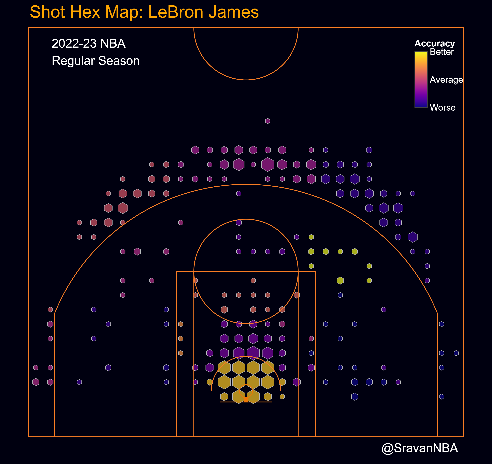

+++
title = "Introducing Simple Shot Quality Model (SSQM) v1.0"
date = "2024-02-17"
description = "My first attempt at creating a shot quality model using publicly available NBA data"

draft = false

[taxonomies]
tags = ["Shooting","Shot Quality","SSQM"]
categories = ["NBA"]
[extra]
math = true
math_auto_render = true
keywords = "Shooting, Shot Quality"
+++

My first attempt at creating a shot quality model using publicly available NBA data

## Introduction
While I was digging into adjusted net ratings ([you can find my article here](https://blog.sradjoker.cc/posts/nba-sosadj/)), I found a version of luck adjusted team ratings by [Krishna Narsu](https://twitter.com/knarsu3) using `qSQ` (Quantified Shot Quality) and `qSI`(Quantified Shooter Impact). I have been interested in shot quality ever since. The disadvantage of these metrics is that they are from Second Spectrum and not public. So wanted to see if I can develop a model on my own using publicly available shooting data.

## Methodology
### Getting Started
Before starting from scratch I look at existing work from other people. [Ryan Davis](https://github.com/rd11490/NBA_Tutorials) and [Andrew Patton](https://github.com/anpatton/basic-nba-tutorials) have good tutorials for NBA Analytics with working code and those are always good place to start when working on a new analytics project. I found [Andrew Patton's Shot Quality Model Tutorial](https://github.com/anpatton/basic-nba-tutorials/tree/main/shot-quality) interesting. Andrew shows the approach of how to model shot quality and the data processing framework necessary for creating a shot quality metric. After trying my own variations of Andrew's demo shot quality models, I wanted to try something different while utilizing some of the concepts he introduced in the tutorial.

### Approach: Using League Average Shooting
I have been making NBA Hex Plots for more than 2 years now.

The different colors in hex plots shows how efficient a player is wrt league average. I accomplish it by binning the shots into different zones and calculating the `FG%` of all shots in the zone attempted by the player. I then compare it to the league average `FG%` of all shots in the zone attempted by all players in that season. Here are the shot zones and the league averages shown in [Steph Curry's shot-chart](https://www.nba.com/stats/events?flag=3&CFID=33&CFPARAMS=2023-24&PlayerID=201939&ContextMeasure=FGA&Season=2023-24&section=player&sct=hex) for the season:

<!--  -->

My idea is that the approach I adopted for the hex plots is a good framework for a `Simple Shot Quality Model` and thus name `SSQM` (sounds like a good name for a model which is very simple/basic).

### Developing the Shot Quality Model Metrics
I will be using the league average `FG%` as expected `FG%` in my model and will refer it as `xFG` from now now.  
So the expected points scored are:


xPTS=\begin{cases}
    2\times FGA \times xFG  &, FGA \text{ is 2 pointer} \\ 
    3\times FGA \times xFG  &, FGA \text{ is 3 pointer} \\ 
\end{cases}
 

Effective field goal percentage (`eFG`) is calculated as:
  
$$ eFG = \frac{PTS}{2\times FGA} $$

Similarly expected `eFG` (`xeFG`) is calculated by replacing `PTS` with `xPTS`.
  
$$ xeFG = \frac{xPTS}{2\times FGA} $$

`Shot Making` is defined as:

$$ \text{Shot Making} = \frac{PTS - xPTS}{FGA} $$

which is nothing but points per point (PPS) above league average.

`Points Added` is defined as:

$$ \text{Points Added} = PTS - xPTS $$

Another way of calculating `Points Added`:

$$ \text{Points Added} = \text{Shot Making}\times FGA $$

## Results

Now that I have a Shot Quality Model based on shot location (grouped in zones), I ran it for the 2023-24 NBA season to generate the shot quality metrics for all players. An issue here is that there are players who have not attempted many shots but made most of them. We need to filter those players out, which can be accomplished by removing players who have scored less than 100 points.

### Best Shot Makers 
Here are the best shot makers in the league i.e. the players having the highest `Shot Making` values:

|    | Player           | Team                  |   FGA |   FGM |   eFG |   xeFG |   PTS |   xPTS |   Shot Making |   Points Added |
|---:|:-----------------|:----------------------|------:|------:|------:|-------:|------:|-------:|--------------:|---------------:|
|  1 | Jalen Smith      | Indiana Pacers        |   253 |   160 | 0.719 |  0.577 |   364 |  291.9 |          0.28 |          70.84 |
|  2 | Amir Coffey      | LA Clippers           |   162 |    91 | 0.673 |  0.55  |   218 |  178.2 |          0.25 |          40.5  |
|  3 | Dereck Lively II | Dallas Mavericks      |   208 |   153 | 0.736 |  0.619 |   306 |  257.6 |          0.23 |          47.84 |
|  4 | Nicolas Batum    | Philadelphia 76ers    |   135 |    70 | 0.681 |  0.577 |   184 |  155.7 |          0.21 |          28.35 |
|  5 | Garrison Mathews | Atlanta Hawks         |    99 |    45 | 0.657 |  0.554 |   130 |  109.7 |          0.21 |          20.79 |
|  6 | Kevin Durant     | Phoenix Suns          |   912 |   491 | 0.598 |  0.497 |  1090 |  907.2 |          0.2  |         182.4  |
|  7 | Matt Ryan        | New Orleans Pelicans  |    85 |    38 | 0.635 |  0.536 |   108 |   91.1 |          0.2  |          17    |
|  8 | Jakob Poeltl     | Toronto Raptors       |   320 |   216 | 0.675 |  0.58  |   432 |  371.4 |          0.19 |          60.8  |
|  9 | Aaron Wiggins    | Oklahoma City Thunder |   211 |   123 | 0.68  |  0.587 |   287 |  247.6 |          0.19 |          40.09 |
| 10 | Grayson Allen    | Phoenix Suns          |   414 |   211 | 0.658 |  0.566 |   545 |  468.9 |          0.18 |          74.52 |

The players here include centers like Jalen Smith (who also shoots 3s), Lively and Poeltl and three point shooters like Grayson Allen, Batum. The only super star in here is Kevin Durant, who is have a ridiculous shooting season.

### Worst Shot Makers
Here are the worst shot makers in the league i.e. the players having the lowest `Shot Making` values:

|    | Player          | Team                   |   FGA |   FGM |   eFG |   xeFG |   PTS |   xPTS |   Shot Making |   Points Added |
|---:|:----------------|:-----------------------|------:|------:|------:|-------:|------:|-------:|--------------:|---------------:|
|  1 | JT Thor         | Charlotte Hornets      |   139 |    51 | 0.435 |  0.573 |   121 |  159.3 |         -0.28 |         -38.92 |
|  2 | Xavier Tillman  | Boston Celtics         |   213 |    87 | 0.437 |  0.567 |   186 |  241.7 |         -0.26 |         -55.38 |
|  3 | Isaiah Livers   | Washington Wizards     |   116 |    40 | 0.44  |  0.557 |   102 |  129.1 |         -0.23 |         -26.68 |
|  4 | Scoot Henderson | Portland Trail Blazers |   506 |   190 | 0.427 |  0.544 |   432 |  550.2 |         -0.23 |        -116.38 |
|  5 | Josh Okogie     | Phoenix Suns           |   183 |    76 | 0.481 |  0.591 |   176 |  216.1 |         -0.22 |         -40.26 |
|  6 | Kris Murray     | Portland Trail Blazers |   118 |    48 | 0.487 |  0.591 |   115 |  139.5 |         -0.21 |         -24.78 |
|  7 | David Roddy     | Phoenix Suns           |   389 |   157 | 0.465 |  0.568 |   362 |  441.9 |         -0.21 |         -81.69 |
|  8 | Mike Muscala    | Detroit Pistons        |   134 |    48 | 0.459 |  0.552 |   123 |  148   |         -0.19 |         -25.46 |
|  9 | Cam Reddish     | Los Angeles Lakers     |   205 |    83 | 0.483 |  0.577 |   198 |  236.7 |         -0.19 |         -38.95 |
| 10 | Chris Duarte    | Sacramento Kings       |   129 |    47 | 0.453 |  0.551 |   117 |  142.1 |         -0.19 |         -24.51 |

This list is made mostly of young players who are trying to find their place in the league including rookies like Scoot Henderson. It is very hard to adjust to the NBA and it shows up in their shooting numbers. The other players here are Mike Muscala, who are aging centers who are older than 30 years. Loss of athleticism has an adverse impact on shot making.

### Most Points Added: Best Volume Shot Makers
Just looking at `Shot Making` doesn't tell the whole story of best shot makers in the league. The `Shot Making` value is actualized only if the players are taking lots of the shots. So the best shot makers in the league are who make lots of shots at high volume. To differentiate these players (who are all stars) from best players in `Shot Making` metric, I call them **Volume Shot Makers**. These players are players who have the highest `Points Added` Metric:

|    | Player                  | Team                  |   FGA |   FGM |   eFG |   xeFG |   PTS |   xPTS |   Shot Making |   Points Added |
|---:|:------------------------|:----------------------|------:|------:|------:|-------:|------:|-------:|--------------:|---------------:|
|  1 | Kevin Durant            | Phoenix Suns          |   912 |   491 | 0.598 |  0.497 |  1090 |  907.2 |          0.2  |         182.4  |
|  2 | Nikola Jokic            | Denver Nuggets        |   937 |   541 | 0.607 |  0.529 |  1138 |  991.7 |          0.16 |         149.92 |
|  3 | Kawhi Leonard           | LA Clippers           |   820 |   432 | 0.595 |  0.516 |   976 |  846.1 |          0.16 |         131.2  |
|  4 | Stephen Curry           | Golden State Warriors |   989 |   457 | 0.589 |  0.524 |  1166 | 1036.8 |          0.13 |         128.57 |
|  5 | Luka Doncic             | Dallas Mavericks      |  1102 |   542 | 0.574 |  0.518 |  1265 | 1141.8 |          0.11 |         121.22 |
|  6 | Shai Gilgeous-Alexander | Oklahoma City Thunder |  1063 |   580 | 0.576 |  0.527 |  1225 | 1119.4 |          0.1  |         106.3  |
|  7 | Devin Booker            | Phoenix Suns          |   864 |   432 | 0.557 |  0.5   |   963 |  864.7 |          0.11 |          95.04 |
|  8 | Giannis Antetokounmpo   | Milwaukee Bucks       |  1017 |   626 | 0.627 |  0.584 |  1276 | 1186.9 |          0.09 |          91.53 |
|  9 | Jalen Williams          | Oklahoma City Thunder |   662 |   360 | 0.598 |  0.535 |   792 |  708   |          0.13 |          86.06 |
| 10 | Domantas Sabonis        | Sacramento Kings      |   706 |   439 | 0.64  |  0.581 |   904 |  821   |          0.12 |          84.72 |

This list mostly consists of super stars and all-stars except for Jalen Williams who is having a hyper efficient season fo far. The list being comprised of stars is expected since taking and making tough shots is what makes them stars. 

### Most Points Removed: Worst Volume Shot Makers

Now let's look at the worst volume shot makers, these are players with the lowest `Points Added` metric:

|    | Player            | Team                   |   FGA |   FGM |   eFG |   xeFG |   PTS |   xPTS |   Shot Making |   Points Added |
|---:|:------------------|:-----------------------|------:|------:|------:|-------:|------:|-------:|--------------:|---------------:|
|  1 | Scoot Henderson   | Portland Trail Blazers |   506 |   190 | 0.427 |  0.544 |   432 |  550.2 |         -0.23 |        -116.38 |
|  2 | Jalen Green       | Houston Rockets        |   815 |   335 | 0.477 |  0.545 |   778 |  889.1 |         -0.14 |        -114.1  |
|  3 | Jordan Poole      | Washington Wizards     |   730 |   292 | 0.469 |  0.533 |   685 |  778.8 |         -0.13 |         -94.9  |
|  4 | Russell Westbrook | LA Clippers            |   523 |   242 | 0.497 |  0.575 |   520 |  601.6 |         -0.16 |         -83.68 |
|  5 | Saddiq Bey        | Atlanta Hawks          |   585 |   247 | 0.504 |  0.576 |   590 |  674.1 |         -0.14 |         -81.9  |
|  6 | David Roddy       | Phoenix Suns           |   389 |   157 | 0.465 |  0.568 |   362 |  441.9 |         -0.21 |         -81.69 |
|  7 | Jeremy Sochan     | San Antonio Spurs      |   557 |   246 | 0.488 |  0.557 |   544 |  620.8 |         -0.14 |         -77.98 |
|  8 | Keldon Johnson    | San Antonio Spurs      |   668 |   299 | 0.513 |  0.563 |   685 |  752   |         -0.1  |         -66.8  |
|  9 | Josh Giddey       | Oklahoma City Thunder  |   550 |   246 | 0.494 |  0.554 |   543 |  609.9 |         -0.12 |         -66    |
| 10 | Damian Lillard    | Milwaukee Bucks        |   887 |   375 | 0.506 |  0.541 |   898 |  959.1 |         -0.07 |         -62.09 |

This list consists of young players and players on bad teams like Jordan Poole and Keldon Johnson. An interesting observation is that guards comprise of most of this list. I was expecting to find Russell Westbrook in here but was shocked to find Damian Lillard. Dame is having a horrible season so far and Bucks have no shot to compete for a NBA championship unless Dame shoots better. Both Russ and Dame are in a long line of aging superstar guards who drop off in mid 30s. While for Russ it has been a gradual process, for Dame it has been a sudden drop off this year. 

## Conclusions
I've developed a simple shot quality model `SSQM v1.0` based on publicly available shooting data. The model is based purely on shot location (shot zones to be more specific). Then we can sort the players by the shot quality metrics like `Shot Making` and `Points Added` to find best and worst **shot makers** and **volume shot makers**.

While working on this model, it came to my mind that only shot location is not a holistic way of looking at shot quality and there should be other factors like shot type, defender distance, touch time, dribble etc. which need to be incorporated in the model. I'm working on `SSQM v2.0` which does exactly that and I will release a follow up to this blog describing that model.

Thank you for reading, and any feedback is appreciated. You can reach me on Twitter at [@SravanNBA](https://twitter.com/SravanNBA).

## Resources 

[Andrew Patton's Shot Quality Model Tutorial](https://github.com/anpatton/basic-nba-tutorials/tree/main/shot-quality)

