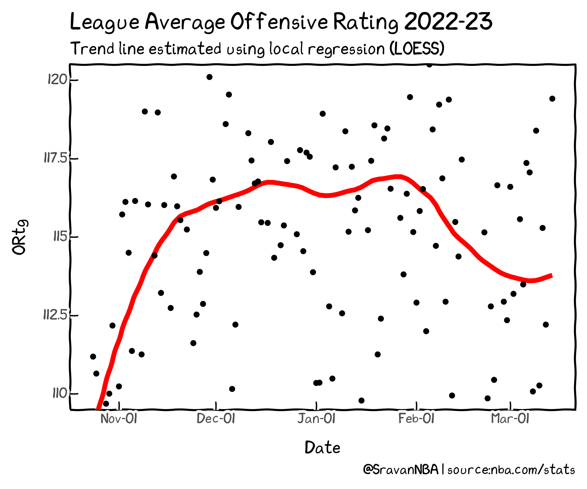
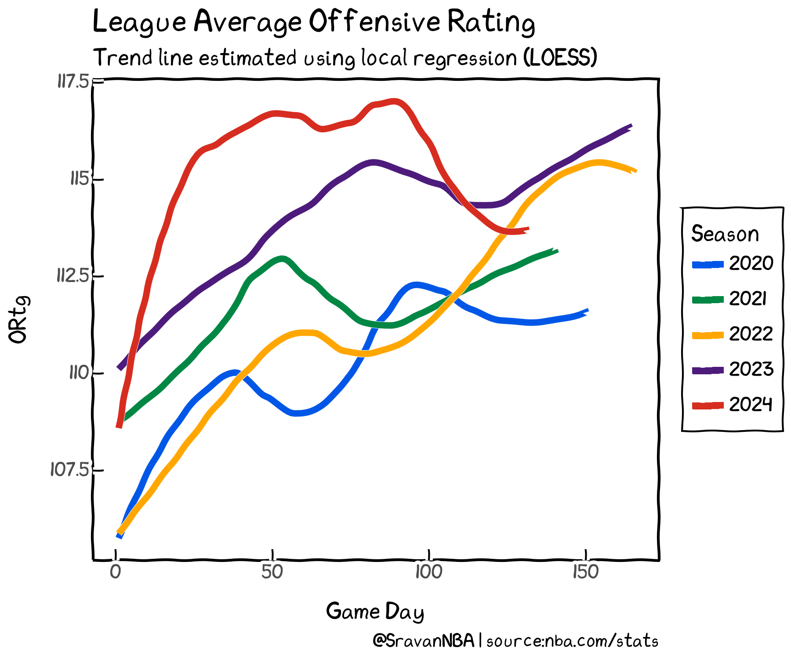
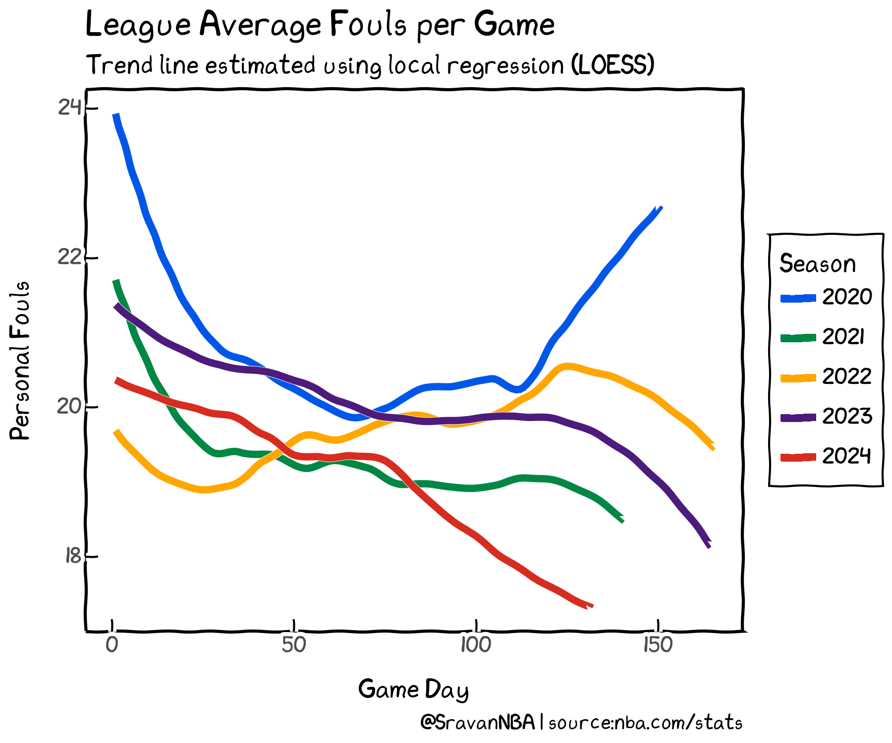
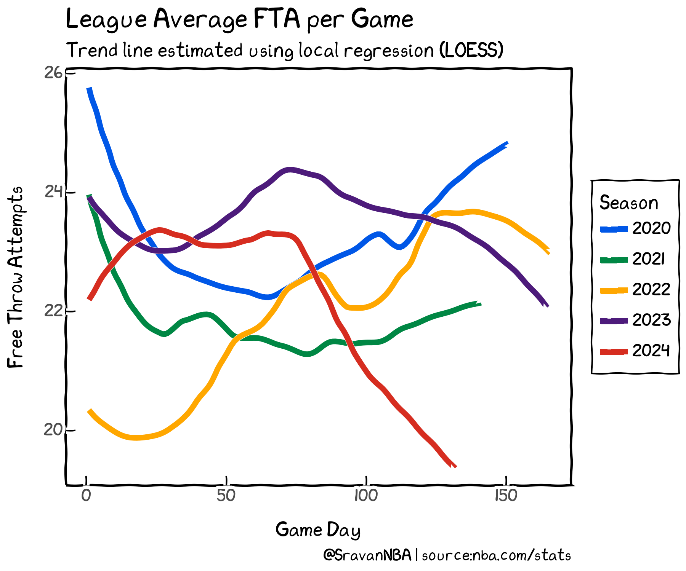
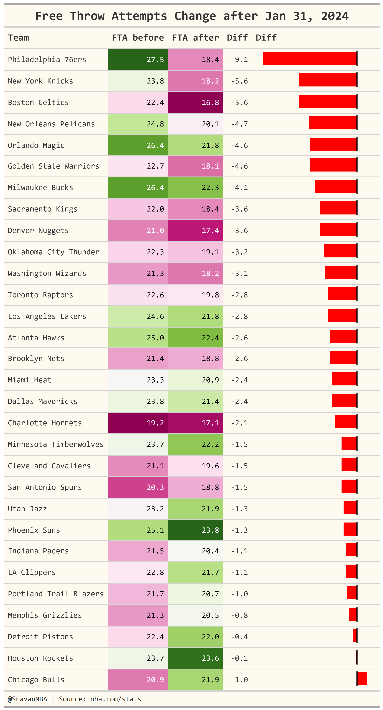
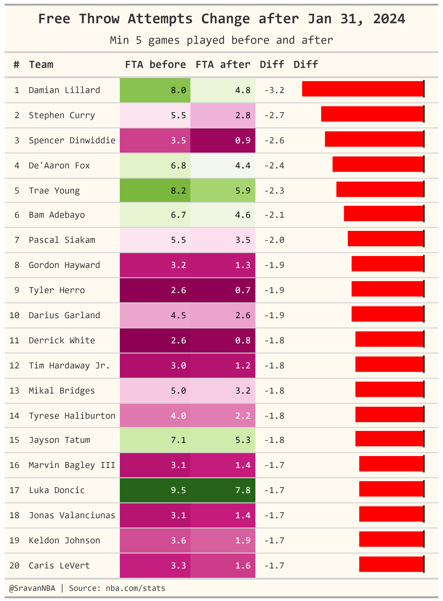
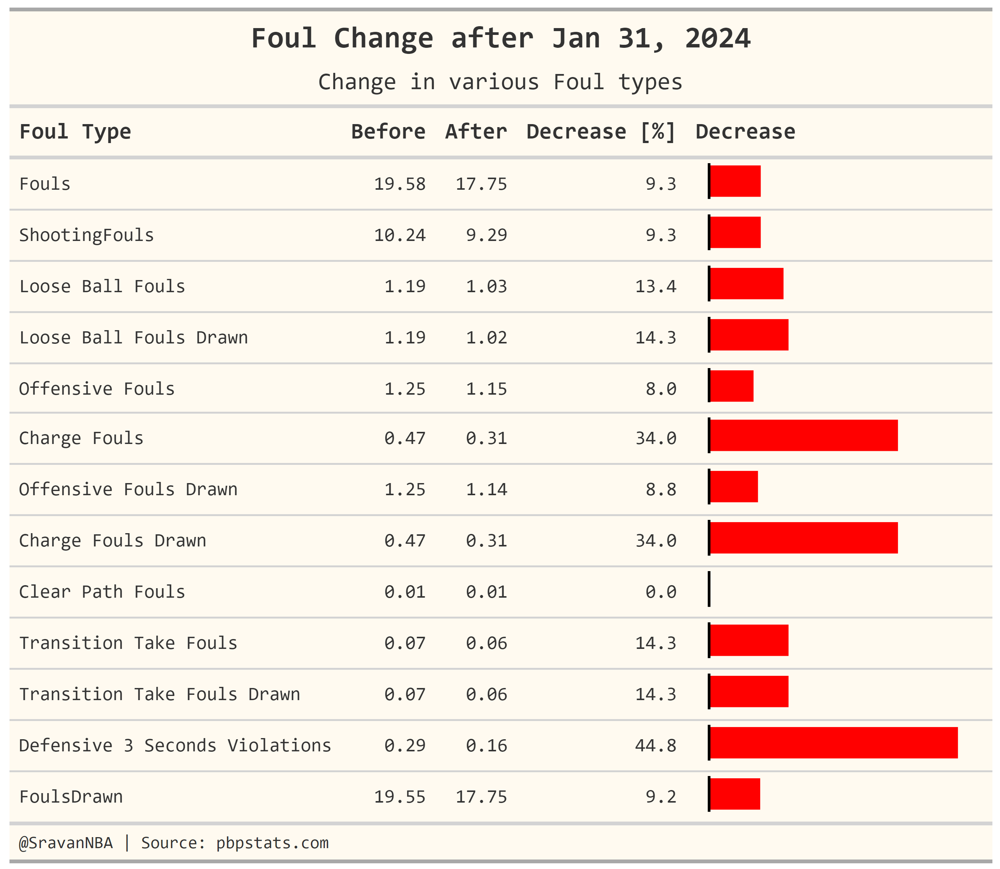
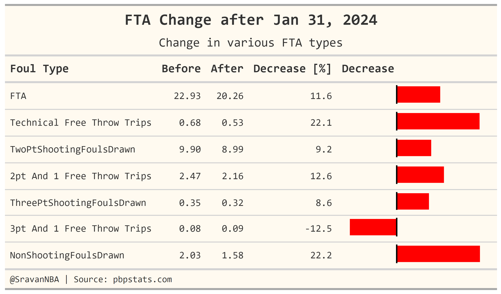

+++
title = "Explaining the drop in Offensive Rating during 2023-24 NBA Season"
date = "2024-03-15"
description = "NBA offenses used to score a lot earlier this season, why aren't they not scoring as much?"

draft = false

[taxonomies]
tags = ["trends","team-ratings","fouls"]
categories = ["NBA"]
[extra]
math = true
math_auto_render = true
keywords = "Offensive Rating, Fouls, Referees, Free Throws"
+++

NBA offenses used to score a lot earlier this season, why aren't they not scoring as much?

## Introduction
This is the question which is in the minds of many NBA fans over the past 2 weeks. Many fans and people who cover the NBA have observed that scoring is down in NBA after the all star break. First person who noticed it and tried analysis this drop is [Tom Haberstroh](https://twitter.com/tomhaberstroh/status/1763659791061143881). Unfortunately the excellent analysis by Tom is behind and paywall. [Lev Akabas](https://twitter.com/LevAkabas/status/1763941905925050613) from Sportico was the first person in the public sphere to attribute this to the drop in shooting fouls. [Nate Duncan and Seth Partnow](https://twitter.com/NateDuncanNBA/status/1766210436825788877) have also tried to attribute the drop in offense to how the fouls were called but that too is unfortunately hidden behind a paywall. Since paywalls were preventing me to see the reasons behind the drop in offense, I started doing statistical analysis of the drop in offense on March 6 and tried to find reasons behind the phenomena over the past 10 days, resulting in these tweets: [1](https://x.com/SravanNBA/status/1765527432382292152), [2](https://x.com/SravanNBA/status/1765531685008126222), [3](https://x.com/SravanNBA/status/1765547650659877073), [4](https://x.com/SravanNBA/status/1765548437502853625), [5](https://twitter.com/SravanNBA/status/1767193986060726676), [6](https://twitter.com/SravanNBA/status/1767235318246502660), [7](https://twitter.com/SravanNBA/status/1767606753813041373), [8](https://twitter.com/SravanNBA/status/1767623246126747776). 

I feel that I analysis I did is not consolidated and thus didn't tell a full story for people who have followed my work. Only public article which tackled these issues is by [Zach Kram](https://twitter.com/zachkram/status/1768295800512156046) on [TheRinger](https://www.theringer.com/nba/2024/3/14/24100106/dallas-mavericks-anthony-edwards-nba-offense-fouls-pace-kram-session), who referenced my [work](https://twitter.com/SravanNBA/status/1768282951568211978). So here is a blog post, which will try to consolidate my previous spread out work with updated data and try to tell the story of offenses during the 2023-24 NBA Season.

## Drop in Offense
The first question is to look at the offensive rating trends during the season. To do this, I calculated the average offensive rating of each game day i.e. of all games played during a day. I then plotted the trend-line of the offensive rating using [local regression](https://en.wikipedia.org/wiki/Local_regression)(LOESS):

We see that league average offense rose more than 5 points during the month of November, before stabilizing during December and January, staying almost flat during those those months. Then after Jan 31, 2024, we see a sharp drop of almost 4 points. The drop happened for he whole month of February, before finally stabilizing in the month of March.

Now lets compare this trend to the last 5 seasons:

We see that league average offenses outside of this season keep increasing during the first few months of the season before taking a dip before the all the break. Then the offenses keep increasing till the season end. The only outlier is this season, where we see a sharp drop in offensive rating even before the all star break and then no recovery after the all star break.

So we have seen above that the drop in offensive rating is an anomaly which doesn't occur in other seasons. Now's lets try to find reasons behind why this drop occurred this season

# Drop in Fouls
First place to look for is places other people have already looked i.e. fouls:

We can see that there is a downward trend in fouls in all of the last 5 seasons, including this season. In many seasons the drop is steep at the beginning of the season and then stabilizing afterwards with little to no change. Other seasons have a sharp drop at the end of the season. But no season has a drop in fouls in the middle of the season like the 2023-24 season. And the plot shows that there are two rates of decrease in fouls, the slower rate (smaller slope) for the first 70 game days and then the faster rate (larger slope) afterwards. This results in the lowest foul rate in past 5 seasons. But the shape of the trend line in this plot doesn't exactly track with the shape of the trend line first plot. So, I went looking for other reasons to why there is a drop in offensive rating and found it.

## Drop in Free Throw Attempts:
Now, let's look at the trend in Free Throw Attempts(FTA):

FTA for past five seasons, excluding this one shows no particular trend. But for this season, we see a sharp drop off after game day 80, which tracks almost exactly with the drop in offensive rating. 
>So, we finally found the reason: free throws

i.e. the referees are just not calling shooting fouls, resulting in lower free throws. Let's now analyze the drop in free throws in detail.

## FTA change per team
As noted earlier, the drop in offensive ratings happen after **Jan 31,2024**. I will due that date as a separating line i.e. all games played on or before that date belong to the **before** category and all games played after that date belong to the **after** category.
This table shows which teams were most effected by the decrease in FTA:

We see all teams, except for the Chicago Bulls see a drop in FTA. The drop in FTA for the two teams on the top can be easily explained with the Joel Embiid and the Julius Randle injuries. But for the other teams: not so much. Interestingly, most teams in the Top 10 in FTA drop are playoff race (top 6 seeds), except for the Warriors who are in the play-in race. This includes the top 2 seeds in both conferences: BOS, MIL, DEN and OKC. The teams in the bottom 5 in this table are all bad teams (again, except for the Bulls).

## FTA change in players
This table shows which players had the largest drop in FTA:

Interesting to see that most of this list is made of guards, including some star ones like Damian Lillard, Steph Curry, Fox, Trae Young, Haliburton and Luka Doncic. There are some forwards too including: Tatum, Hayward, Mikal, Keldon and Siakam. Only centers are Bam and Bagley.

## Change in Individual Foul Types:
In this section we'll look at the detailed breakdown in the decrease in fouls, i.e. looking at the changes in the individual foul types. This data is obtained by parsing play-by-play and is taken from pbpstats.com.

We see that there is a 9.3 drop in both overall fouls and shooting fouls.The foul categories which have the largest drops are charges, and defensive threes seconds. This shows that more physical play is allowed to occur in the paint area.

## Change in Individual FTA Types:
In this section we'll look at the detailed breakdown in the decrease in FTA, i.e. looking at the changes in the individual FTA types. This data is obtained by parsing play-by-play and is taken from pbpstats.com.

We see that FTA have show a larger decrease (11.6%) compared to fouls (9.3%). There has also been a drop in non shooting fouls i.e. less fouls in the bonus up to 22%. Technical free throws also have a 22% drop. 

## Conclusions

In this article, I analyze the trends in the drop in offensive rating and find reasons behind the drop. The main reason is drop in FTA, which the drop in offensive rating is highly correlated to. I also try to analyze which team and player see the largest changes in FTA and finally analyze the drops in individual categories of fouls and FTA.

Thank you for reading, and any feedback is appreciated. You can reach me on Twitter at [@SravanNBA](https://twitter.com/SravanNBA).
