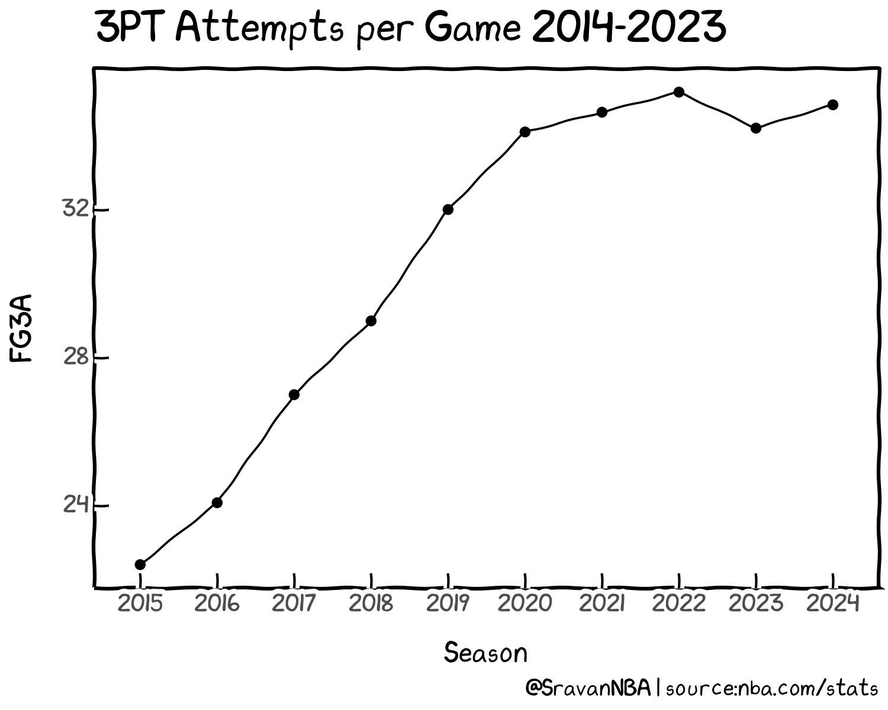
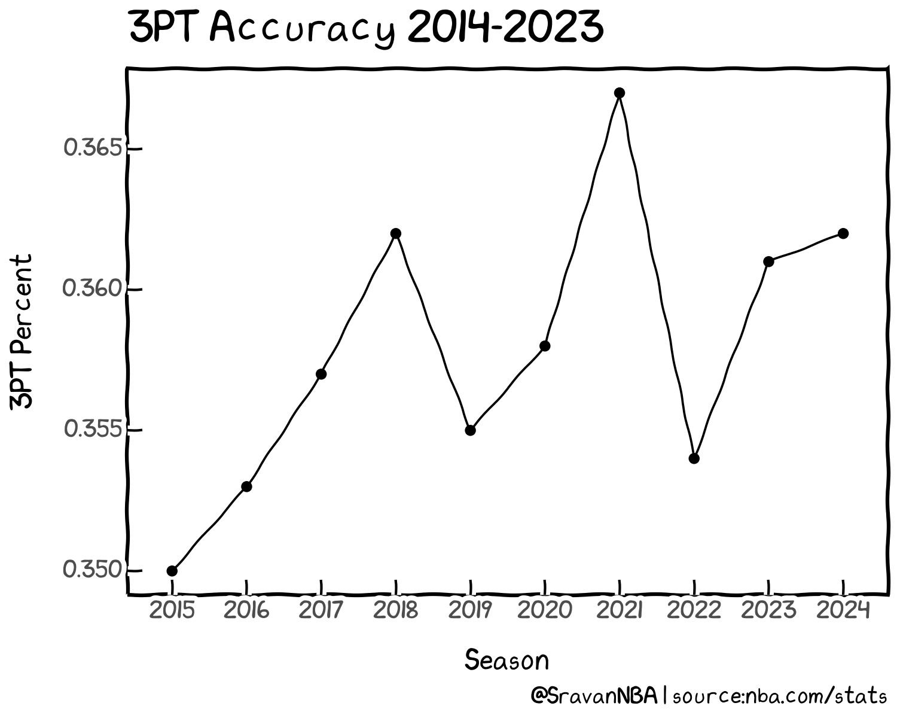
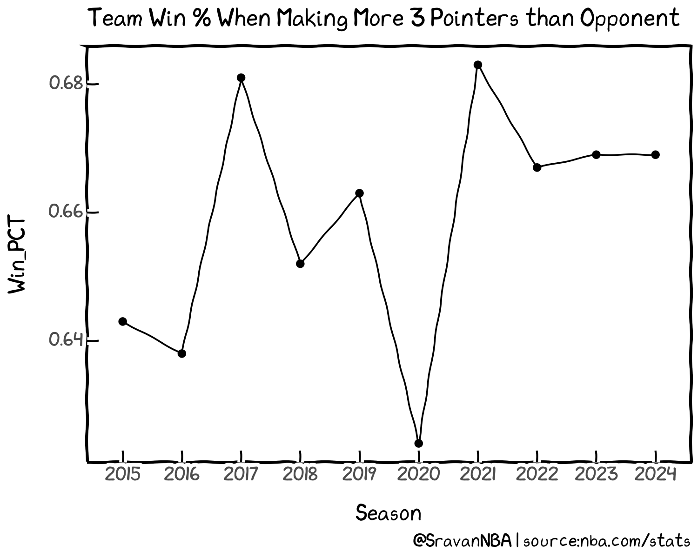
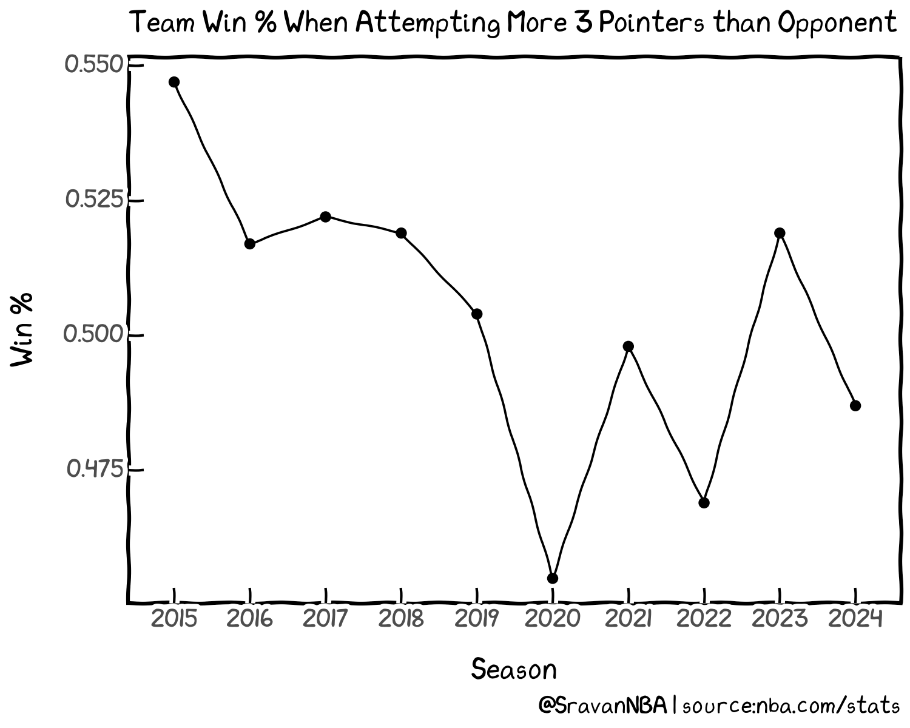
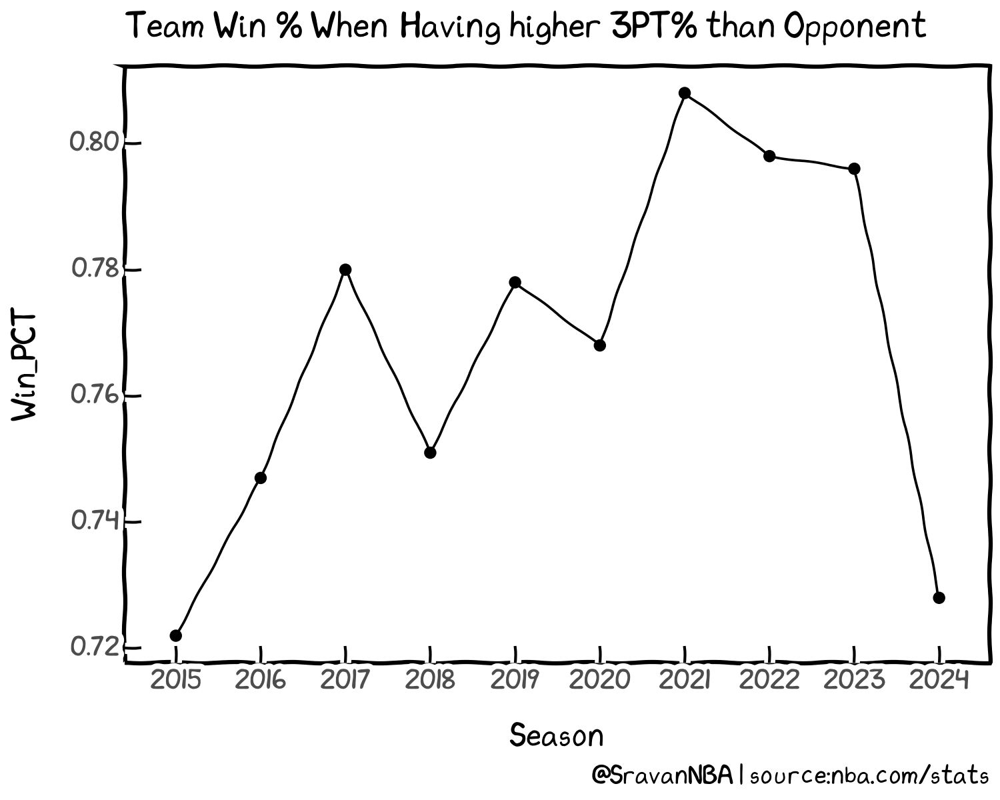

+++
title = "How does 3 Point Shooting Relate to Winning in the NBA"
date = "2023-12-12"
description = "Analyzing three point trends in the NBA and see how they relate to wins"

[taxonomies]
tags = ["NBA","shooting","3PT","win-loss"]
+++

## Introduction
Three point shooting is everywhere in the NBA currently. Teams are attempting and making more threes. Here is 3 Point attempts (3PA) per game (PG) every season for the last 10 seasons (including this one):

3PTA per game was around 22 in 2014-15 and increased every year till 2021-22 season. The 3PTA per game since has stabilized to a value between 34-35 per game. Meanwhile the accuracy of 3PT shots hasn't changed drastically over the years, fluctuating between 35 and 37%:

What I'm interesting in exploring is how important 3PT shooting is to winning games, which is the end goal.

## How often does a team win when it outscores its opponent from 3PT range:
First aspect I want to explore is the raw output, i.e. what if a team makes more 3's than its opponent. Here is how often do teams win in those situations:

We see that teams win anywhere between 64-68% when they make more 3s than their opponents. This translates to 52.5 to 56 wins in an 82 game season. The win percent has stabilized to around 66.9% over the past 3 seasons, equivalent to around 55 wins. 

So, we can conclude that making more 3 pointers than opponents plays a huge role in winning, and teams win around 2/3rd of their games in such situations.

## How often does a team win when it is more accurate than its opponent from 3PT range:
### Team 3PT % > Opponent 3PT %
Next, I want to explore how important is the accuracy i.e. the 3PT percentage, rather than makes, is to team winning.
Here is how often do teams win in those situations:

We see that teams win anywhere between 68-74% when they make more 3s than their opponents. This translates to 55 to 60.5 wins in an 82 game season. The win percent is around 70.5% over the past 2 seasons, equivalent to around 58 wins. 

Thus, we see that teams win at a slightly higher rate when they're more accurate from 3, compared to just making more 3s.  

### Team 3PT % > Opponent 3PT % + 5%
Now, what if team 3PT% is 5% higher than opponent 3PT%:

In this situation, teams win anywhere between 72% and 81%, which is a much higher percentage than the previous situations explored.
This is equivalent to 59-66.5 wins during an 82 game season. We observe an increasing trend in win% in this condition from 2014-2021, peaking at 80.8% during 2020-21 season. Then, there was a slight drop off to 79.8% during 2021-22 and 79.6% during 2022-23, before going through a sharp drop off to 72.8% for this season. Since, only a quarter of this season's game have been played as of today, there is a chance that this number might rise by the end of the season. I think we have to revisit and observe the trend at the end of the season.

So, removing this season, the teams are winning at around 80%, equivalent to 65.5 wins when teams 3PT% is 5% higher than opponent 3PT%. This condition shows a much higher correlation to winning than the previous conditions considered, which were closer to 55-58 wins. 

## Conclusion

Analyzing the 3PT trends over the past 10 seasons, we see that 3PT accuracy has a very high correlation to winning. Teams are winning 80% of their games when team 3PT% is 5% higher than opponent 3PT%, equivalent to 65.5 wins during an 82 game season. This number shows the importance of accurate 3PT shooting to winning in the NBA.

Thank you for reading and any feedback is appreciated. You can reach me on Twitter at [@SravanNBA](https://twitter.com/SravanNBA).

