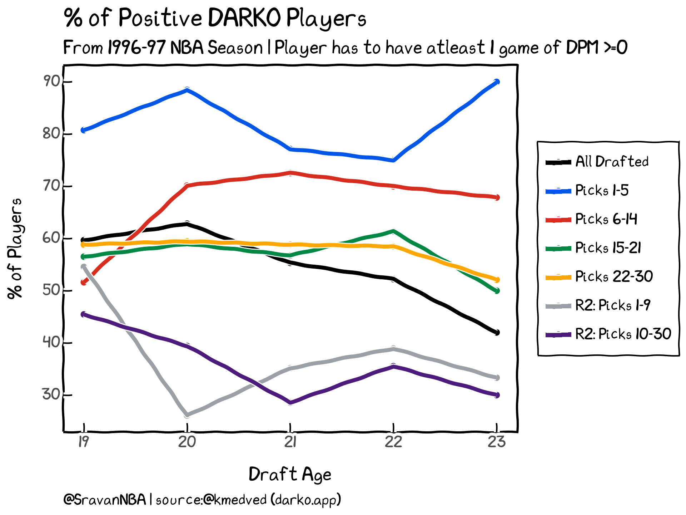
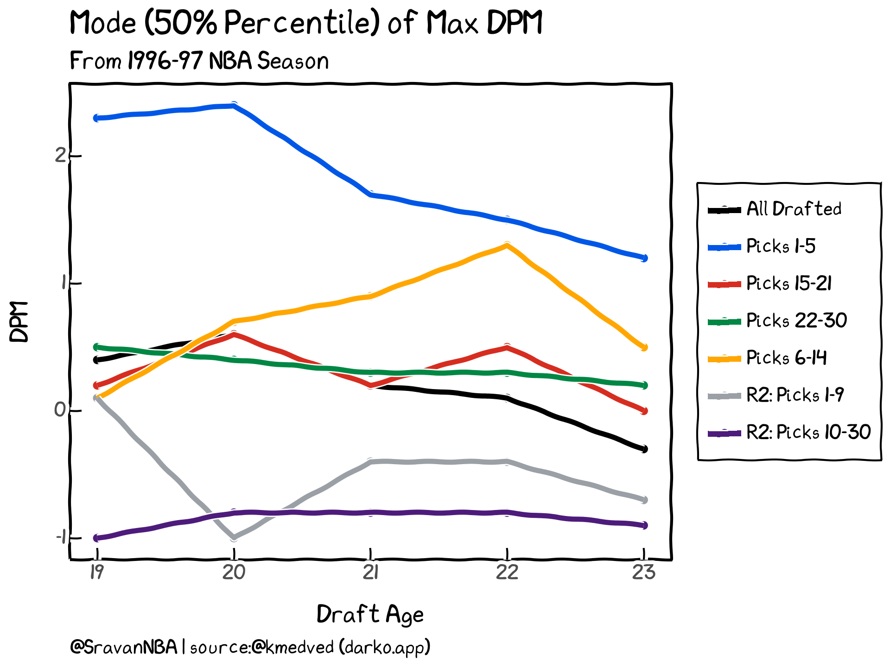

+++
title = "NBA Draft Age Analysis I: Are Players Drafted at a Young Age Productive"
date = "2024-01-20"
description = "Analyzing the productivity of young players in the NBA"

draft = true

[taxonomies]
tags = ["draft","trends"]
categories = ["NBA"]
[extra]
toc = true
keywords = ""
+++

This blog post is Part I of a series of draft analysis articles I plan to write. The main goal of this study is to analyze the productivity of players drafted at different ages. 

## Introduction
This study was inspired by a [discussion](https://twitter.com/bballstrategy/status/1739082125054459906) I found on Twitter by [Crow](https://twitter.com/bballstrategy),  [Chucking Darts](https://twitter.com/ChuckingDarts), and [Nathan Grubel](https://twitter.com/DraftDeeper). The beginning point of their conversation was the excellent play of [Craig Porter [Jr.](https://twitter.com/StephNoh/status/1738926975824150849), an old undrafted rookie, playing for the Cleveland Cavaliers. Here is another [thread](https://twitter.com/bballstrategy/status/1739324759274639486) by Crow, expanding on the earlier discussion, making the case for teams to draft older, more productive players earlier in the draft, leading to me thinking that:

> NBA teams are addicted to potential and not production

So, I started an analysis to see if I could make a case for teams to draft older players earlier in the draft. 
Due to further discussions with [Crow](https://twitter.com/bballstrategy), this analysis eventually evolved into something much more.

## Evaluation Method
I was considering several metrics for evaluation, including [BPM](https://www.basketball-reference.com/about/bpm2.html), [LEBRON](https://www.bball-index.com/lebron-introduction/), and [DARKO](https://apanalytics.shinyapps.io/DARKO/) in the form of DARKO Plus Minus (DPM).
The metric I finally landed on was DARKO (DPM) due to the following reasons:

- It is a RAPM-based metric, unlike BPM, which is based purely on boxscore. This means that it has both a boxscore component and an on-off component. Some players are productive on the court despite not putting up huge stats, and DARKO covers them.
- It has data from the 1996-97 season (LEBRON has data only from the 2008-09 season onwards), giving me more players to analyze. So this analysis covers players drafted in 28 seasons from 1996 onwards, which counts to 1458 players.
- DPM is calculated daily, so I have much richer (granular) data, thus allowing me to use career game numbers as an evaluation method (to be discussed later).
- This data is available publicly via an [app](https://apanalytics.shinyapps.io/DARKO/) or as a [Google sheet](https://docs.google.com/spreadsheets/d/1mhwOLqPu2F9026EQiVxFPIN1t9RGafGpl-dokaIsm9c/htmlview#). [Kostya Medvedovsky](https://twitter.com/kmedved) was kind enough to provide me with historical daily data used in this study.

After choosing the evaluation metric, I had to decide how to use it. I first wanted to check if the draft pick was a success, i.e., if the player was successful in his career. I define success as:

> A player is considered successful if he reached a value of DPM>=0 at least once in his career

As a RAPM-based metric, DPM is regularized at 0, i.e., the average (mean and not median) value of DPM for the league is 0. A player with a DPM of zero can be considered a positive player on the court. Positive players comprise approximately 1/3 of the active players in the NBA. So, if a player is a positive player for at least one game, I consider his career successful.

DARKO is predictive in nature:

> DARKO considers every NBA game a player has ever played in making its projections, weighing each game as appropriate based on recency, with the weights varying by stat being projected.

The projection aspect of DARKO is another reason why it is a suitable method for this style of analysis. The player is projected to have a positive impact on the next game if he has a DPM value of 0. 

The second evaluation method I choose is the player's peak performance. The value of maximum DPM throughout his career gives us a reasonable estimate of the player's peak performance. So, in this study, I will evaluate the peak impact of the player, in addition to the player's just being successful.

## Success % of Players

First, I study the number of successful players sorted by the draft age. The age groups I've chosen are 19 (including 18-year-olds), 20, 21, 22, and 23. 

Players drafted at the age of 20 have the highest success rate at 62.8%, followed by players drafted at 19 with 59.7%.
The success rate then drops every age from 21 to 23, with 23-year-olds only having a success rate of 41.4%

Here is the boxplot of career games taken to reach the positive DPM value, i.e., DPM>=0. Career games taken to reach positive DPM value measure how long a player takes to become productive. 

The table below shows detailed stats of the same information. The percentages shown here are the percentiles. Other columns include the number of players, such as the count, mean, min, max, and standard deviation.

|    |   Draft Age |   count |   mean |   min |   25% |   50% |   75% |   max |   std |
|---:|------------:|--------:|-------:|------:|------:|------:|------:|------:|------:|
|  1 |          19 |      71 |    143 |     2 |    38 |   100 |   190 |   661 |   136 |
|  2 |          20 |     164 |    149 |     2 |    42 |   114 |   212 |   758 |   133 |
|  3 |          21 |     140 |    153 |     2 |    52 |   104 |   198 |   743 |   144 |
|  4 |          22 |     153 |    133 |     3 |    44 |   105 |   185 |   536 |   111 |
|  5 |          23 |     134 |    157 |     1 |    59 |   116 |   244 |   539 |   130 |

We can see that the median(50th percentile) game # to reach positive DPM for all ages is very similar, ranging from 100-116 games. This means a player can be a positive player within 1.5 seasons of their career in the NBA. The 25th percentile values show that 19-year-olds first took 38 games. 23-year-olds are slowest here, taking 59 games. 75th percentile values take anywhere between 185 to 244 games, which turns out to be in the 3rd season of NBA careers.
So, 75% of drafted NBA players turn out to be positive players within three seasons. This result is so interesting to me because of this take I have had for so many years now:
> I always say that we have to take at least 3 years to decide whether a young player is good or not. I evaluate young players only after they spend 3 seasons in the NBA.

It's nice to see the data back up my take. Also, I expected older drafted players (22, 23-year-olds) to have less variance than younger players. Surprisingly, this is true for 22-year-olds but not for 23-year-olds. In fact, 23-year-olds have the highest variance among all five age groups. Maybe this is because some older drafted players aren't talented enough to become productive players in the NBA.

## Success % of Players Grouped by Pick Number

We've seen the overall trends of all drafted players. But not all drafted players are the same. In the draft, the players who are projected to be better are drafted earlier. Hence, where a player is drafted is a measure of his projected talent and plays a huge role in discussing how a player has panned out. 

Let's start by looking at the success percentages of players grouped by draft positions. Here are the groups I've chosen after consulting with other people:
- Picks 1-5
- Picks 6-14
- Picks 15-21
- Picks 21-30
- R2: Picks 1-9
- R2: Picks 10-30

We see that players picked from 1-5 in the 1st round have a very high success rate of ~80%, regardless of the age at which they were drafted. Picks 6-14 have a success rate of ~70%, except for 19-year-olds. Players drafted at 19 years in picks 6-14 have a success rate of 50%, which is lower than the success rate of 19-year-olds drafted in picks 15-30 and also picks 1-9 in the 2nd round.

> I see a high bust potential of very young players drafted in mid-late lottery. Historic data shows that teams are better off drafting 20-year-olds with those picks.

Players drafted between picks 15-21 have a success rate between 55-60%, except for 23-year-olds, who have a lower rate at 50%. Similarly, players drafted between picks 22-30 have a success rate of ~58% across different age groups, except for 23-year-olds, who have a lower rate of 52%. It's interesting to see that players with non-lottery draft picks (i.e., Picks 15-30) have similar success rates.
In general, older players (22, 23-year-olds) drafted in non-lottery 1st round over-perform average success rate, while the younger players are at the average success rate. 

In the second round, the only group with a success rate above 50% is the 19-year-olds drafted in picks 1-9, with a value of 54%.

> 19-year-olds drafted early in 2nd round have similar success rates to 19 year drafted in 1st round between picks 6-30. This makes early 2nd picks more valuable and I think Front offices should exploit it more. 

Similarly, from picks 10-30 in the 2nd round, 19-year-olds have the highest success rate at 45%. But, in general, apart from 19-year-olds, the players drafted in the 2nd round have a success rate of 40%.

## Peak Performance of Players
We've seen the success rate of drafted players in the previous section. Now, let's look at the peak performance of players.
Here is the boxplot of the maximum DPM of a player's career, grouped by Player age. 

The table below shows detailed stats of the same information. The percentages shown here are the percentiles. Other columns include the number of players, such as the count, mean, min, max, and standard deviation.

|    |   Draft Age |   count |   mean |   min |   25% |   50% |   75% |   max |   std |
|---:|------------:|--------:|-------:|------:|------:|------:|------:|------:|------:|
|  1 |          19 |     119 |    1   |  -2.4 |  -0.7 |   0.4 |   2.3 |   9.5 |   2.2 |
|  2 |          20 |     261 |    0.8 |  -3.1 |  -0.7 |   0.6 |   2   |   8.5 |   2   |
|  3 |          21 |     253 |    0.6 |  -2.7 |  -0.9 |   0.2 |   1.5 |   8.4 |   2   |
|  4 |          22 |     293 |    0.4 |  -2.8 |  -1   |   0.1 |   1.4 |  10.4 |   1.8 |
|  5 |          23 |     319 |   -0.1 |  -3.3 |  -1.3 |  -0.3 |   0.8 |   6.5 |   1.6 |

The median (50% percentile) is highest for 20-year-olds, with a value of 0.6. Otherwise, the median for max DPM decreases with age 19-23 years, with only 23-year-olds having a negative value. We can also see that the variance in maximum DPM decreases with age. That is, younger drafted players have a higher variability in peak performance than older drafted players. This makes sense as young players come into the league raw and generally have to be developed to reach their peak performance. Meanwhile, older players come into the league more polished, having spent their developmental years in college/elsewhere, and their development in the league is minimal.

Now we look at the median (50% percentile) of maximum DPM sorted by Pick numbers as we did in previous sections:

The players drafted at the age of 19-20 with picks 1-5 have the highest peak with max DPM >2. Players of those ages drafted with other picks have a much lower max DPM with values <0.5. For picks 5-30 and 2nd round picks 1-9, the max DPM values are between 0 and 0.5, but for 2nd round picks 10-30, the max DPM values are ~ -1.

Late 2nd rounders have a max DPM of ~ -1 for age ranges. Meanwhile, early 2nd rounders have positive DPM for 19-year-olds but negative DPM values for all other age ranges.

Returning to the first round, the maximum DPM values of players drafted from 15-30 (mid-late 1st round) is between 0 and 0.5. This means that while they're positive players, it is hard for them to be very good players with DPM>1. 

Looking at the lottery picks, for 21-23 year-olds drafted in with picks 1-5, all have max DPM>1. Players of that age drafted with picks 6-14 have a max DPM>0.5. 

A surprising result is with picks 6-14, players with draft age 22 are the most positive, with the only group with max DPM>1. Players with draft ages 20, 21, and 23 have values between 0.5 and 1. But players with a draft age of 19 have a maximum DPM of only 0.1. This confirms my statement in an earlier section that I see a high bust potential of 19-year-olds drafted in the mid to late lottery.

## Parting Thoughts

In this study, I analyze the success rate and peak performance of drafted NBA players with draft age as the primary sorting mechanism. Further effects of what pick number the player is drafted at (a measure of talent) are also analyzed. I have shown that the initial premise I started the study on is wrong and that older players who are more productive in the NBA are few and far between. 

I want to thank [Crow](https://twitter.com/bballstrategy), [Kostya Medvedovsky](https://twitter.com/kmedved), and [Krishna Narsu](https://twitter.com/knarsu3), whose discussions and inputs were valuable to this study. 
Thank you for reading, and any feedback is appreciated. You can reach me on Twitter at [@SravanNBA](https://twitter.com/SravanNBA).

## Additional Reading
- [What is the best way to draft?](https://www.bourbonstreetshots.com/2020/07/28/what-is-the-best-way-to-draft/) by [Shamit Dua](https://twitter.com/FearTheBrown)
- [Why a player’s birthday can matter so much for college, NBA success](https://theathletic.com/3691009/2022/10/24/player-birthday-college-nba/?source=user_shared_article) by [CJ Moore](https://twitter.com/cjmoorehoops)
